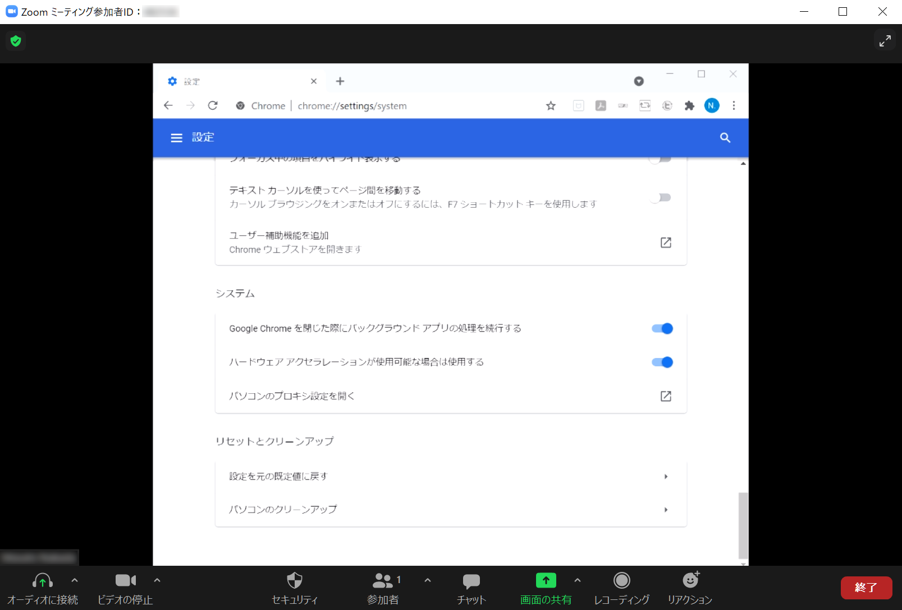

# NMUniversalVCamFilter
WinRTのGraphicsCaptureAPIでキャプチャしたウィンドウを仮想カメラとして映すサンプル



WinRTのGraphicsCaptureAPIを利用して、キャプチャしたウィンドウ映像をZoomなどに映す仮想カメラです。
DirectShow, WinRTのWindowsGraphicsCaptureAPIを利用しております。GDI関数を使用する場合と違い、
ハードウェアアクセラレーション処理のかかったウィンドウも映すことができます。
仮想カメラを自作する際の参考になればと思い、公開しました。

ここのコードや記事を主に参考にしております。（細かい部分で参考にした記事等は`stdafx.h`に掲載しております。）

[mysourcefilter](https://github.com/syu5-gh/mysourcefilter)

[svcam](https://github.com/aricatamoy/svcam)

[Windows 10のウィンドウキャプチャAPI](https://qiita.com/eguo/items/90604787a6098af404d9)

[CapturePreview](https://github.com/opysky/examples/tree/master/winrt/GraphicsCapture/CapturePreview)

# 解説記事
DirectShowとWinRTを組み合わせる際の注意点をQiitaにもとしてあげております。こちらもご覧ください。

- [WinRTのWindowsGraphicsCaptureAPIでキャプチャしたウィンドウをDirectShowで自作した仮想カメラに映そう](https://qiita.com/HexagramNM/items/8493350d40608433421c)

- [ComputeShaderでの最適化例: DirectShowの仮想カメラ](https://qiita.com/HexagramNM/items/b75ca3894b88bdaf1c0b)


# ブランチ （新しい順）
- `main`... 最新のバージョン (DirectXOptimizedのバージョンとほぼ同じ)

- `DirectXOptimized`... 「ComputeShaderでの最適化例: DirectShowの仮想カメラ」の記事を書いたタイミングのDirectXによる最適化を適用したバージョン

- `OnlyOffScreenRendering`... WindowsGraphicsCapture APIで取得されたテクスチャの変形をCPUではなくDirectXでオフスクリーンレンダリングすることで最適化したバージョン

- `Old_cpuProcessing`... DirectXによる最適化を適用する前の最初のバージョン

# ビルド方法

Visual Studio 2017で開発をしておりました。

1. [ここ](https://developer.microsoft.com/ja-jp/windows/downloads/windows-10-sdk/)からWindows 10 SDK (10.0.19041.0)をインストールします。（新しいWindowsSDKでないとコンパイルできません。）

2. コンパイルの際にはDirectShowのライブラリが必要です。[ここ](https://github.com/ganboing/sdk71examples)からダウンロードし、`multimedia/directshow/baseclasses`にあるコードをビルドしてください。

3. `baseclasses`をコンパイル出来たら、`NMUniversalVCamFilter`プロジェクトをC++の空のプロジェクトとしてつくり、その中にこのリポジトリ内の.cppファイル、.hファイル、`module32.def`、`module64.def`を入れてください。

4. `NMVCamFilter`プロジェクトのプロパティから以下のように設定してください。
- **「全般」→「構成の種類」**：ダイナミックライブラリ (.dll)
- **「全般」→「文字セット」**：Unicode文字セットを使用する
- **「C/C++」→「全般」→「追加のインクルードディレクトリ」**：`multimedia/directshow/baseclasses`フォルダの絶対パス
- **「C/C++」→「プリプロセッサ」→「プリプロセッサの定義」**：\
WIN32 \
_DEBUG（Debug構成の場合。Releaseの場合はNDEBUGに変更する。） \
_WINDOWS \
_USRDLL \
MYSOURCEFILTER_EXPORTS
- **「C/C++」→「言語」→「準拠モード」**：いいえ
- **「C/C++」→「言語」→「C++ 言語標準」**：ISO C++17 標準 (/std:C++17)
- **「リンカー」→「全般」→「追加のライブラリディレクトリ」**：`baseclasses`のコンパイルにより生成された`Release`または`Debug`フォルダの絶対パス。x64プラットフォームの場合は`x64/Debug`や`x64/Release`になるので注意。
- **「リンカー」→「入力」→「モジュール定義ファイル」**：プラットフォームがWin32の場合は`module32.def`, x64の場合は`module64.def`

生成されたdllファイルはwindowsのSystem32もしくはSysWOW64に入っている、`regsvr32.exe`で登録することで使えるようになります。


# 参考にしたコードの著作権表示（MITライセンス）

mysourcefilter（ここから派生して開発しております。）
```
The MIT License (MIT)

Copyright (c) 2013 mahorigahama

Permission is hereby granted, free of charge, to any person obtaining a copy of
this software and associated documentation files (the "Software"), to deal in
the Software without restriction, including without limitation the rights to
use, copy, modify, merge, publish, distribute, sublicense, and/or sell copies of
the Software, and to permit persons to whom the Software is furnished to do so,
subject to the following conditions:

The above copyright notice and this permission notice shall be included in all
copies or substantial portions of the Software.

THE SOFTWARE IS PROVIDED "AS IS", WITHOUT WARRANTY OF ANY KIND, EXPRESS OR
IMPLIED, INCLUDING BUT NOT LIMITED TO THE WARRANTIES OF MERCHANTABILITY, FITNESS
FOR A PARTICULAR PURPOSE AND NONINFRINGEMENT. IN NO EVENT SHALL THE AUTHORS OR
COPYRIGHT HOLDERS BE LIABLE FOR ANY CLAIM, DAMAGES OR OTHER LIABILITY, WHETHER
IN AN ACTION OF CONTRACT, TORT OR OTHERWISE, ARISING FROM, OUT OF OR IN
CONNECTION WITH THE SOFTWARE OR THE USE OR OTHER DEALINGS IN THE SOFTWARE.
```

CapturePreview（WinRTのGraphicsCaptureAPI周りはここのコードを参考にしております。）
```
MIT License

Copyright (c) 2018 opysky

Permission is hereby granted, free of charge, to any person obtaining a copy
of this software and associated documentation files (the "Software"), to deal
in the Software without restriction, including without limitation the rights
to use, copy, modify, merge, publish, distribute, sublicense, and/or sell
copies of the Software, and to permit persons to whom the Software is
furnished to do so, subject to the following conditions:

The above copyright notice and this permission notice shall be included in all
copies or substantial portions of the Software.

THE SOFTWARE IS PROVIDED "AS IS", WITHOUT WARRANTY OF ANY KIND, EXPRESS OR
IMPLIED, INCLUDING BUT NOT LIMITED TO THE WARRANTIES OF MERCHANTABILITY,
FITNESS FOR A PARTICULAR PURPOSE AND NONINFRINGEMENT. IN NO EVENT SHALL THE
AUTHORS OR COPYRIGHT HOLDERS BE LIABLE FOR ANY CLAIM, DAMAGES OR OTHER
LIABILITY, WHETHER IN AN ACTION OF CONTRACT, TORT OR OTHERWISE, ARISING FROM,
OUT OF OR IN CONNECTION WITH THE SOFTWARE OR THE USE OR OTHER DEALINGS IN THE
SOFTWARE.
```
